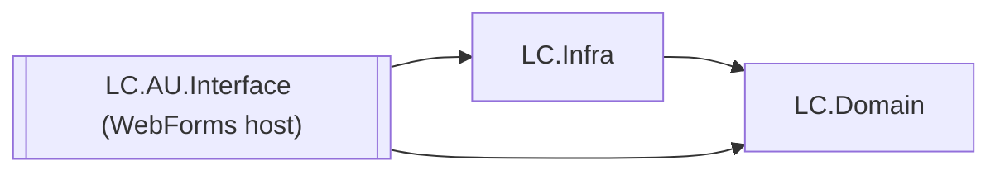

# Phase 4 preview — worked example

This is the literal chat output Phase 4 produces for the AutoClone-family fixtures
shipped at `templates/discovery-example.json` + `templates/deep-analysis-example.json`.
It demonstrates: artifact ordering, byte-count headers, the inline Mermaid block,
the confirmation prompt, a sample `skip <name>` reply, and the final summary.

Anything between `--- chat output ---` markers below is what the **skill** prints.
Anything between `--- user reply ---` markers is what the **user** types back.

---

--- chat output ---

I scanned `/d/Codes/LegalControl/AutoClone/LegalControl`. Detected stacks: C# (3
projects), ASP.NET WebForms (Forms auth). Roslyn CLI not on PATH — C# analysis
used the Grep fallback. Below is the proposed context.

**CLAUDE.md** (1688 bytes / 5120 cap)

```markdown
# LegalControl

<!-- auto-generated:phase3 start -->
ASP.NET WebForms (Forms authentication) modular monolith, ~3 C# projects on
.NET Framework. Auth lives in `Interface/LC.AU.Interface/`. Login URL: `/login.aspx`.
<!-- auto-generated:phase3 end -->

## Stack

<!-- auto-generated:phase3 start -->
- **C#** — 3 modules (analysed via Grep fallback).
- **WebForms** — Forms auth, 1 host project.
<!-- auto-generated:phase3 end -->

## Entry Points

<!-- auto-generated:phase3 start -->
- `Interface/LC.AU.Interface/LC.AU.Interface/Global.asax` (csharp)
<!-- auto-generated:phase3 end -->

## Module Layout

<!-- auto-generated:phase3 start -->
- **LC.Domain** (csharp) — `Domain/LC.Domain`: AuthenticationDomain, UsuarioDomain
- **LC.Infra** (csharp) — `Infra/LC.Infra`: AuthRepository, UsuarioRepository
- **LC.AU.Interface** (csharp, webforms host) — `Interface/LC.AU.Interface/LC.AU.Interface`
<!-- auto-generated:phase3 end -->

## Conventions

<!-- auto-generated:phase3 start -->
(no conventions discovered yet — add as you learn them)
<!-- auto-generated:phase3 end -->

## Where to Find X

<!-- auto-generated:phase3 start -->
| Topic | Location |
|---|---|
| Auth Web.config | `Interface/LC.AU.Interface/LC.AU.Interface/Web.config` |
| Login page | `Interface/LC.AU.Interface/LC.AU.Interface/login.aspx` |
| Solution | `LegalControl.sln` |
<!-- auto-generated:phase3 end -->
```

**docs/dep-graph.mmd** (3 nodes, 3 edges)



**Memory files** (5 files, repo-hash `fc2d77a2`)

- `~/.claude/projects/fc2d77a2/memory/MEMORY.md` — index of topic files
- `~/.claude/projects/fc2d77a2/memory/conventions.md` — discovered patterns and gotchas
- `~/.claude/projects/fc2d77a2/memory/entry-points.md` — where execution starts
- `~/.claude/projects/fc2d77a2/memory/modules.md` — top-level project / package map
- `~/.claude/projects/fc2d77a2/memory/overview.md` — what this repo is and why
- `~/.claude/projects/fc2d77a2/memory/webforms.md` — auth + login URL pointer

Write these artifacts? Reply **yes** to write all, **no** to abort, or list the
artifacts to skip (e.g. "skip dep-graph, skip memories"). Default is **no**.

--- chat output ---

--- user reply ---
skip memories
--- user reply ---

--- chat output ---

wrote CLAUDE.md (1688 bytes)
wrote docs/dep-graph.mmd (381 bytes)

Archive this context to an Obsidian vault? Reply with the vault name (e.g.
`Personal`), or **no** to skip.

--- chat output ---

--- user reply ---
Personal
--- user reply ---

--- chat output ---

archived to Obsidian vault "Personal" as note "Project Context — LegalControl — 2026-05-07"

init-project-context complete:
  rootPath:    /d/Codes/LegalControl/AutoClone/LegalControl
  repo-hash:   fc2d77a2
  artifacts written:
    - CLAUDE.md (1688 bytes)
    - docs/dep-graph.mmd (381 bytes)
  obsidian:    archived to Personal:Project Context — LegalControl — 2026-05-07
  next steps:  open a fresh Claude Code session — the new memories auto-load.

--- chat output ---

---

## Variant: full abort

If the user replies `no` (or hits Enter on an empty line) after the preview:

--- chat output ---

no artifacts written

init-project-context complete:
  rootPath:    /d/Codes/LegalControl/AutoClone/LegalControl
  repo-hash:   fc2d77a2
  artifacts written: none — user aborted at step 2
  obsidian:    skipped
  next steps:  re-run /init-project-context when ready.

--- chat output ---

---

## Variant: Obsidian CLI absent

If `shutil.which("obsidian")` returns `None` and the user named a vault:

--- chat output ---

obsidian CLI not found on PATH — skipping vault export. On-disk artifacts remain.

init-project-context complete:
  rootPath:    /d/Codes/LegalControl/AutoClone/LegalControl
  repo-hash:   fc2d77a2
  artifacts written:
    - CLAUDE.md (1688 bytes)
    - docs/dep-graph.mmd (381 bytes)
    - 5 memory files at ~/.claude/projects/fc2d77a2/memory/
  obsidian:    not available
  next steps:  open a fresh Claude Code session — the new memories auto-load.

--- chat output ---
